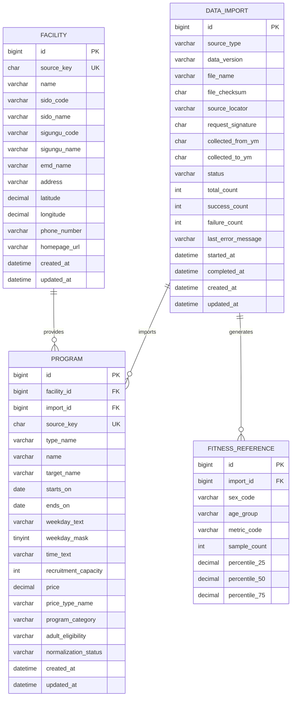

# FitDaero MVP ERD

## 1. 설계 원칙

- 체력 API의 개인별 측정행과 운동처방 원문 `pres_note`는 서비스 DB에 저장하지 않는다.
- 체력 API 원본은 성인·성별·10세 단위 연령대·측정항목별 기준 통계만 생성한다.
- 프로그램 데이터에서 반복되는 시설 정보는 `facility`로 분리한다.
- 원본의 대중교통 1~5순위 정보는 MVP에서 저장하지 않는다. 거리·길찾기가 범위 밖이기 때문이다.
- 프로그램 시간은 원문만 보관하고 필터에 사용하지 않는다.

## 2. 논리 ERD



## 3. 테이블 정의

### `data_import`

원천 버전의 마지막 처리 상태를 보관하는 적재 이력이다. `id`는 단일 기본 키(PK)이며, 다음은 중복 방지용 복합 유니크 제약이다.

| 제약 | 의미 |
| --- | --- |
| `UNIQUE(source_type, file_checksum)` | 같은 프로그램 파일의 중복 적재 방지 |
| `UNIQUE(source_type, request_signature)` | 같은 체력 API 요청 조건의 중복 배치 방지 |

`data_version`은 API 응답에 노출하는 원천 버전이다. `PUBLIC_FACILITY_PROGRAM`은 확장자를 제외한 원본 파일명, `FITNESS_MEASUREMENT_API`는 `NFA_API_<collected_from_ym>-<collected_to_ym>`으로 기록한다.

`PUBLIC_FACILITY_PROGRAM`은 `file_name`, `file_checksum`을 필수로 사용하고 API 전용 필드는 비운다. `FITNESS_MEASUREMENT_API`는 키를 제외한 API 엔드포인트를 `source_locator`에, 요청 조건 SHA-256을 `request_signature`에, 수집 시작·종료월을 `collected_from_ym`, `collected_to_ym`에 기록하고 파일 전용 필드는 비운다.

`request_signature`에는 API 엔드포인트, 성인 조건, `F/M`, 수집 기간, 응답 형식만 포함한다. API 키와 키가 포함된 URL은 포함하지 않는다.

원천별 필수값은 DB 제약을 지원하는 환경에서는 `CHECK`로, 모든 환경에서는 애플리케이션 검증으로 강제한다. 이 검증으로 복합 유니크 제약에서 `NULL`이 여러 개 허용되는 특성으로 인한 중복 적재를 막는다.

동일 식별자의 상태 전이는 다음과 같다.

| 기존 상태 | 새 실행 처리 |
| --- | --- |
| `COMPLETED` | 실행하지 않는다. |
| `RUNNING` | 중복 실행을 거절한다. |
| `FAILED` | 다음 `APP_IMPORT_ON_STARTUP=true` 실행에서 같은 행을 `RUNNING`으로 되돌려 재시도한다. |

| source_type | 용도 |
| --- | --- |
| `PUBLIC_FACILITY_PROGRAM` | 시설·프로그램 적재 |
| `FITNESS_MEASUREMENT_API` | 체력 기준 통계 생성 |

`last_error_message`에는 마지막 원천 수준 실패의 요약만 기록한다. API 키, 키가 포함된 URL, 개인 측정행, 원본 응답 전문은 기록하지 않는다.

프로그램 원천은 유효 행의 `facility`·`program` upsert와 `COMPLETED` 전환을 하나의 트랜잭션으로 처리한다. 원천 수준 실패가 발생하면 이 변경은 모두 롤백하고, 별도 상태 갱신으로 같은 `data_import` 행을 `FAILED`로 기록한다. 따라서 `program.import_id`는 실패한 프로그램 적재를 가리키지 않는다.

### `facility`

시설명, 행정구역, 주소, 좌표, 연락처, 홈페이지를 보관한다. 원본에 시설 식별자가 없으므로 정규화한 `시설명 + 주소`를 `source_key`로 사용한다. 주소 정정은 새 시설로 보일 수 있는 원본의 한계이며, 안정적인 원본 식별자가 제공될 때 교체한다.

지역 필드는 API와 동일하게 `sido_code/name`, `sigungu_code/name`으로 둔다. 원본의 `CTPRVN_*`, `SIGNGU_*`에 각각 대응한다.

프로그램 적재 시 같은 시설 키가 있으면 가변 정보와 `updated_at`을 갱신하고, 없으면 생성한다. 시설은 특정 `data_import`에 귀속되지 않는다.

### `program`

추천 후보의 현재 정보를 보관한다. 원본에 프로그램 식별자가 없으므로 다음을 정규화·연결한 해시를 `source_key`로 사용한다.

```text
facility source key + 프로그램명 + 시작일 + 종료일 + weekday_mask + 시간 + 대상
```

프로그램명·시간·대상은 앞뒤 공백을 제거하고 연속 공백과 HTML 줄바꿈을 하나의 공백으로 정규화한다. `weekday_text`는 원문, `weekday_mask`는 월~일을 비트로 표현한 검색용 값이며 키에는 원문 대신 비트마스크를 사용한다. 요일을 해석할 수 없는 행은 `weekday_mask`를 비워 추천 후보에서 제외한다.

`program_category`는 추천에 쓰는 10개 종목군 또는 `OTHER`다. `adult_eligibility`는 `ADULT_EXPLICIT`, `ADULT_POSSIBLE`, `UNKNOWN`, `CHILD_ONLY` 중 하나다.

가격, 가격 유형, 모집정원, 프로그램 유형, 종목군, 성인 대상 판정은 키에 넣지 않는 가변 정보다. 프로그램 적재 시 같은 프로그램 키가 있으면 이 값과 마지막 확인 `import_id`, `updated_at`을 갱신하고, 없으면 생성한다. 대상이 다른 동일 시간대 프로그램은 별도 과정일 수 있으므로 대상은 키에 유지한다. 대상 정정은 새 프로그램으로 보일 수 있는 원본 한계다. 원본 CSV에 없는 기존 프로그램은 비활성화하거나 삭제하지 않는다. 원본이 종료 이력을 함께 포함하므로 후보 조회에서 `ends_on >= 요청일`로만 제외한다.

### `fitness_reference`

2022년 이후 성인(19~64세) 여성·남성·10세 단위 연령대별 비교 기준이다. 다음 항목만 저장한다.

| metric_code | 원본 컬럼 | 체력 요소 |
| --- | --- | --- |
| `RELATIVE_GRIP` | `item_f028` | 근력 |
| `SIT_AND_REACH` | `item_f012` | 유연성 |
| `CROSS_SIT_UP` | `item_f019` | 근지구력 |

`age_group`은 `AGE_19_29`, `AGE_30_39`, `AGE_40_49`, `AGE_50_59`, `AGE_60_64` 중 하나다. `import_id + sex_code + age_group + metric_code`을 유일 조합으로 두며, 25·50·75 분위와 표본 수만 보관한다. 개인별 체력 측정행과 운동처방 원문은 보관하지 않는다.

정밀 추천은 `completed_at DESC, id DESC` 순서로 선택한 가장 최근 `COMPLETED` 상태 `FITNESS_MEASUREMENT_API`의 `data_import`에 연결된 기준값만 사용한다.

## 4. 소스 필드 매핑

| 서비스 필드 | 원본 컬럼 |
| --- | --- |
| 시설명 | `FCLTY_NM` |
| 시도·시군구 | `CTPRVN_CD/NM`, `SIGNGU_CD/NM` |
| 주소·좌표·연락처 | `FCLTY_ADDR`, `FCLTY_LA`, `FCLTY_LO`, `FCLTY_TEL_NO` |
| 홈페이지 | `HMPG_URL` |
| 프로그램 분류·명·대상 | `PROGRM_TY_NM`, `PROGRM_NM`, `PROGRM_TRGET_NM` |
| 기간·요일·시간 | `PROGRM_BEGIN_DE`, `PROGRM_END_DE`, `PROGRM_ESTBL_WKDAY_NM`, `PROGRM_ESTBL_TIZN_VALUE` |
| 가격·정원 | `PROGRM_PRC`, `PROGRM_PRC_TY_NM`, `PROGRM_RCRIT_NMPR_CO` |
| 비교 기준 성별·연령 | `test_sex`, `age_gbn`, `age_degree` |
| 측정월 | `test_ym` |
| 정밀 측정값 | `item_f028`, `item_f012`, `item_f019` |

적재 순서·검증·가공 상세는 [적재 명세](data-import.md)를 따른다.
